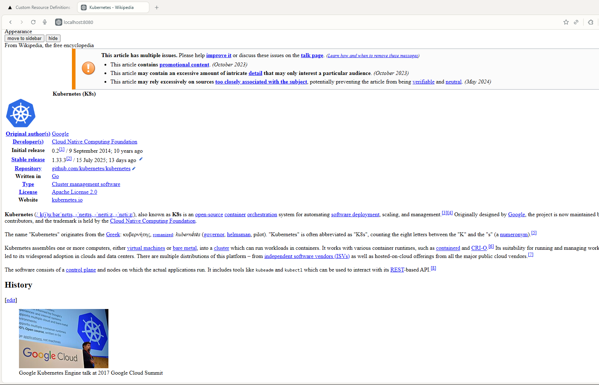

# Kubernetes Custom Resource Definition (CRD)

Created to manage a custom resource in Kubernetes. I've set up a CRD for a "DummySite" and a controller to manage it.

- `DummysiteResourceCreation/`: This directory contains the YAML definitions for my `DummySite` Custom Resource Definition (CRD) and a sample Deployment that uses it.
- `RBAC(role,account,binding)/`: This holds the Role-Based Access Control (RBAC) configurations, including a `ClusterRole`, `ClusterRoleBinding`, and `ServiceAccount` that my controller uses to interact with the Kubernetes API.
- `src/`: This is where the source code for my controller lives. It's a Node.js application that watches for `DummySite` resources and takes action based on their specifications.
- `kustomization.yaml`: This file is used by Kustomize to manage the deployment of all the resources in this project.
- `example.yaml`: A sample `DummySite` resource that I can use to test the controller.

#

Kubernetes cluster and `kubectl` configured to talk to it.

1.  **Install the CRD and RBAC rules:**
    ```bash
    kubectl apply -k .
    ```
2.  **Build and run the controller:**
    The controller is in the `src` directory. I can run it locally or build a Docker image and deploy it to the cluster.

## Usage

Once the controller is running, I can create `DummySite` resources in the cluster. The controller will see them and create a `Deployment` based on the `image` and `website_url` I specify in the `DummySite` resource.

```bash
kubectl apply -f example
kubectl port-forward service/example-site-service 8080:80
```

```
$ kubectl get pod
NAME                                       READY   STATUS    RESTARTS   AGE
dummysite-controller-77d485fbb9-vjg2f      1/1     Running   0          10m
example-site-deployment-864db4f864-4zfpr   1/1     Running   0          7m13s

$ kubectl get svc
NAME                   TYPE        CLUSTER-IP       EXTERNAL-IP   PORT(S)   AGE
example-site-service   ClusterIP   34.118.232.188   <none>        80/TCP    7m18s
kubernetes             ClusterIP   34.118.224.1     <none>        443/TCP   124m
PS E:\CRD>
```


