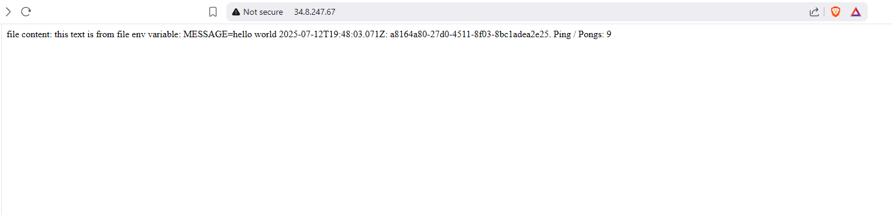
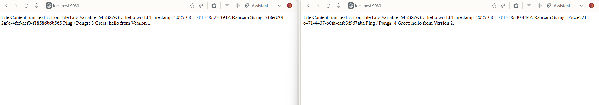

## 5.3. Log app, the Service Mesh Edition

To set up my environment, I first created a k3d cluster with Istio's ambient mesh installed using the following command:

```
stioctl install --set profile=ambient --set values.global.platform=k3d --skip-confirmation
```

Next, I created a k3d cluster with the following configuration:

```
k3d cluster create --api-port 6550 -p '9080:80@loadbalancer' -p '9443:443@loadbalancer' --agents 2 --k3s-arg '--disable=traefik@server:*'
```

I then labeled the namespace for the ambient mesh:

```
kubectl create namespace exercises
kubectl label namespace exercises istio.io/dataplane-mode=ambient
```

After that, I installed Istio ingress using the following command:

```
kubectl create namespace istio-ingress
istioctl install -f ./manifests/IstioOperator/ingress.yaml
```

Subsequently, I applied the pong-application:

```
kubectl apply -k pong-application
```

Following that, I applied the log-output:

```
kubectl apply -k log_output
```

here the [gateway](./manifests/new-gateway.yaml)

```yaml
---
spec:
  hosts:
    - "*"
  gateways:
    - istio-ingress/log-gateway # Full namespace/name reference
  http:
    - match:
        - uri:
            prefix: /pingpong
      rewrite:
        uri: /
      route:
        - destination:
            host: pong-application-svc
            port:
              number: 2345
    - match:
        - uri:
            prefix: /
      route:
        - destination:
            host: log-output-svc
            port:
              number: 80
          weight: 75
        - destination:
            host: log-output-svc2
            port:
              number: 80
          weight: 25
```

Additionally, I applied the following Istio samples for monitoring and visualization:

```
$ kubectl apply -f https://raw.githubusercontent.com/istio/istio/release-1.27/samples/addons/prometheus.yaml

$ kubectl apply -f https://raw.githubusercontent.com/istio/istio/release-1.27/samples/addons/kiali.yaml

```



