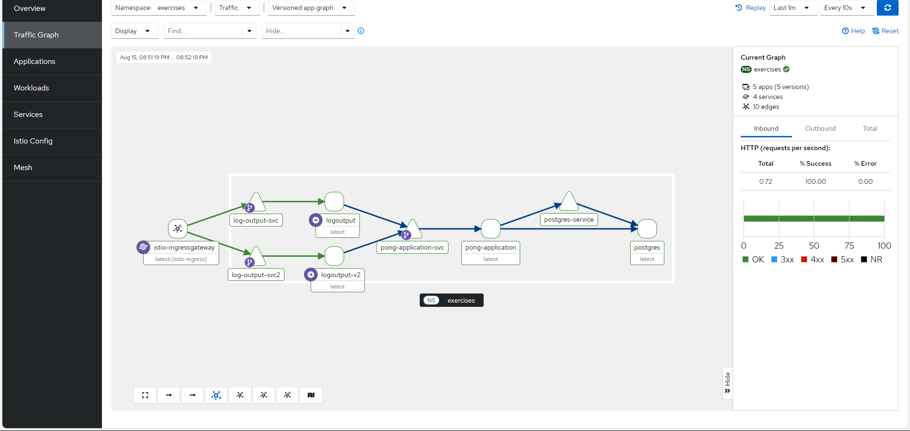

# 3.2. Back to Ingress

> Deployed the "Log output" and ["Ping-pong"](../pong-application/) (both with chnages) applications into GKE and expose it with Ingress.



> 1. Removed the use of service.yaml from from log_output application as we are using "Nodeport" with "Ingress" to expose port layer 7 OSI approch!

- as oppose to layer 5 OSI approch with LoadBalancer service to expose the service in ex 3.1

- NodePort type service is required with an Ingress in GKE. Even though it is NodePort, GKE does not expose it outside the cluster.

> 2.  So removed loadbalancer use from pong-application as well as made the service nodeport type from type clusterIP(GKE need both the application to be either nodeport or service approch)

```js
app.get("/", (req, res) => {
  res.status(200).send("ok");
});
```

> 3. added the above in pong-application's index.js as Ingress expects a service to give a successful response in the path / even if the service is mapped to some other path!

```js
$ kubectl get all -n exercises

NAME                                    READY   STATUS    RESTARTS      AGE
pod/log-output-7bcfc567c-zg2kn          1/1     Running   0             31m
pod/pong-application-84d877cb8d-nt26c   1/1     Running   2 (12m ago)   12m
pod/postgres-0                          1/1     Running   0             12m

NAME                           TYPE        CLUSTER-IP       EXTERNAL-IP   PORT(S)          AGE
service/log-output-svc         NodePort    34.118.230.249   <none>        1234:30611/TCP   31m
service/pong-application-svc   NodePort    34.118.225.13    <none>        2345:31427/TCP   12m
service/postgres-service       ClusterIP   None             <none>        5432/TCP         12m

NAME                               READY   UP-TO-DATE   AVAILABLE   AGE
deployment.apps/log-output         1/1     1            1           31m
deployment.apps/pong-application   1/1     1            1           12m

NAME                                          DESIRED   CURRENT   READY   AGE
replicaset.apps/log-output-7bcfc567c          1         1         1       31m
replicaset.apps/pong-application-84d877cb8d   1         1         1       12m

NAME                        READY   AGE
statefulset.apps/postgres   1/1     12m
-------------------------------------
```

```js
$ kubectl get ing -n exercises

NAME                 CLASS    HOSTS   ADDRESS       PORTS   AGE
log-output-ingress   <none>   *       34.8.247.67   80      18m
```

- This is the only Entery point : http://34.8.247.67 +
  http://34.8.247.67/pingpong etc

```js
$ kubectl get svc -n exercises

NAME                   TYPE        CLUSTER-IP       EXTERNAL-IP   PORT(S)          AGE
log-output-svc         NodePort    34.118.230.249   <none>        1234:30611/TCP   19m
pong-application-svc   NodePort    34.118.225.13    <none>        2345:31427/TCP   86s
postgres-service       ClusterIP   None             <none>        5432/TCP         84s
```

- No service is running so no entrypoint like ex 3.1
