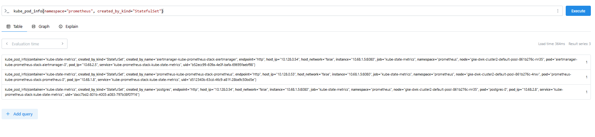

# 4.3. Prometheus
> Started  Prometheus with Helm and use port-forward to access the GUI website and Wrote query that shows the number of pods created by StatefulSets in prometheus namespace.

```yaml
 kubectl get pods -n prometheus --watch
NAME                                                        READY   STATUS    RESTARTS   AGE
alertmanager-kube-prometheus-stack-alertmanager-0           2/2     Running   0          38s
kube-prometheus-stack-grafana-748cbc5458-lbjn8              2/3     Running   0          44s
kube-prometheus-stack-kube-state-metrics-684f8c7558-5gzkp   1/1     Running   0          44s
kube-prometheus-stack-operator-6946c99b76-6vh4w             1/1     Running   0          44s
kube-prometheus-stack-prometheus-node-exporter-bnv97        1/1     Running   0          44s
kube-prometheus-stack-prometheus-node-exporter-ggxrt        1/1     Running   0          44s
kube-prometheus-stack-prometheus-node-exporter-trv4f        1/1     Running   0          45s
prometheus-kube-prometheus-stack-prometheus-0               2/2     Running   0          38s

kubectl -n prometheus port-forward prometheus-kube-prometheus-stack-prometheus-0 9090:9090
Forwarding from 127.0.0.1:9090 -> 9090
Forwarding from [::1]:9090 -> 9090

sum(kube_pod_info{namespace="prometheus", created_by_kind="StatefulSet"})

```



* Also tested:

```js
CPU Usage (instantly reactive):
irate(node_cpu_seconds_total{mode!="idle"}[5m])

RAM usage per node:
node_memory_MemTotal_bytes - node_memory_MemAvailable_bytes

Disk space used:
node_filesystem_size_bytes - node_filesystem_free_bytes
```
