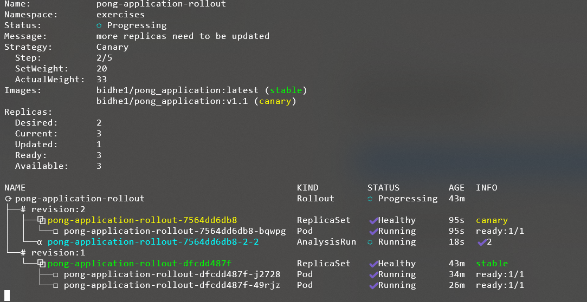

# 4.4. Your canary

> Created an AnalysisTemplate for the Ping-pong app that will follow the CPU usage of all containers in the namespace.

> If the CPU usage rate sum for the namespace increases above a set value within 5 minutes, revert the update.

```yaml
>> kubectl get svc -n prometheus
NAME                                             TYPE        CLUSTER-IP       EXTERNAL-IP   PORT(S)
AGE
alertmanager-operated                            ClusterIP   None             <none>        9093/TCP,9094/TCP,9094/UDP   62m
kube-prometheus-stack-alertmanager               ClusterIP   34.118.228.32    <none>        9093/TCP,8080/TCP
62m
kube-prometheus-stack-grafana                    ClusterIP   34.118.236.173   <none>        80/TCP
62m
kube-prometheus-stack-kube-state-metrics         ClusterIP   34.118.234.241   <none>        8080/TCP
62m
kube-prometheus-stack-operator                   ClusterIP   34.118.233.133   <none>        443/TCP
62m
# this is the one
kube-prometheus-stack-prometheus              ClusterIP   34.118.228.187   <none>        9090/TCP,8080/TCP
62m
kube-prometheus-stack-prometheus-node-exporter   ClusterIP   34.118.229.22    <none>        9100/TCP
62m
prometheus-operated                              ClusterIP   None             <none>        9090/TCP
```

So your internal DNS name is:( will be used in analysis-template for monitoring)

```yaml
http://kube-prometheus-stack-prometheus.prometheus.svc.cluster.local:9090
```

> kubectl -n prometheus port-forward prometheus-kube-prometheus-stack-prometheus-0 9090:9090
> Forwarding from 127.0.0.1:9090 -> 9090
> Forwarding from [::1]:9090 -> 9090

## step 1:

- chnaged the default deployment rollout to [Argo Rollout Deployment](./manifests/deploymentArgo.yaml)
- Created [analysis-template](./manifests/analysis-template.yaml)

## step 2:

Applied

```sh
$ kubectl create namespace argo-rollouts
$ kubectl apply -n argo-rollouts -f https://github.com/argoproj/argo-rollouts/releases/latest/download/install.yaml
```

#

- Note: I have already installed argo and placed that plugin file into same place where is kubectl.exe

## step 3: Watch

```yaml
kubectl argo rollouts get rollout pong-application-rollout -n exercises --watch

kubectl get analysisruns -n  exercises
```



```

The 30s pause(in the deploymentARgo.yaml) BEFORE the analysis step does not impact the analysis run itself.

That pause is just a delay before the analysis even starts.

The Analysis step starts AFTER that 30s pause.

So that 30s doesn’t count toward the count: 10, interval: 15s logic.

| Step | Action          | Time             | Traffic  |
| ---- | --------------- | ---------------- | -------- |
| 1    | Set 20% traffic | 0s               | 20% new  |
| 2    | Pause           | +30s             | 20% new  |
| 3    | Run Analysis    | +150s (10 x 15s) | 20% new  |
| 4    | Pause           | +10s             | 20% new  |
| 5    | Set 100%        | +190s            | 100% new |

1. - setWeight: 20
2. - pause:duration: 30s
3. -analysis:
    templates:
      - templateName: ping-pong-cpu-analysis
4. - pause:
    duration: 10s
5. - setWeight: 100


```


