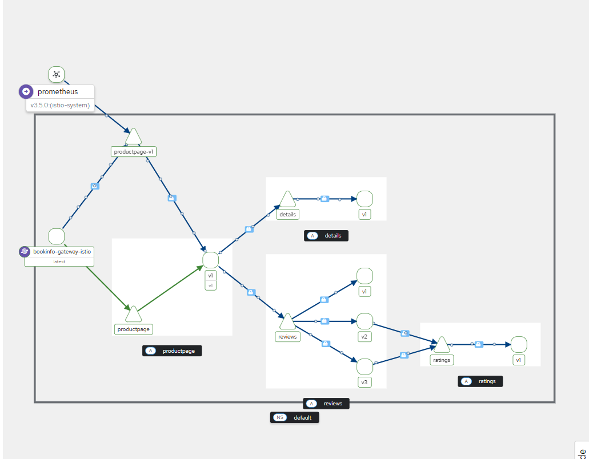

# 5.2 – Getting Started with Istio Ambient Mesh on k3d

## Step 1 – Create the Cluster

I started by creating a local Kubernetes cluster with **k3d**. I exposed ports for HTTP and HTTPS traffic and disabled Traefik since I’ll be using Istio as the ingress controller.

```bash
k3d cluster create --api-port 6550 \
  -p '9080:80@loadbalancer' \
  -p '9443:443@loadbalancer' \
  --agents 2 \
  --k3s-arg '--disable=traefik@server:*'
```

## Step 2 – Install Istio CLI

Since I’m working on k3d, I set the platform accordingly during installation:

```
Set global.platform=k3d
```

Then I installed the **Istio CLI**.

## Step 3 – Load Required Kernel Module

Before installing Istio’s ambient profile, I had to load the `xt_connmark` kernel module, which is part of Linux’s netfilter/iptables system. Without it, iptables rules using `-m connmark` or `--set-mark` will fail, and the ambient service mesh network won’t function properly.

```bash
sudo modprobe xt_connmark
```

## Step 4 – Install Istio Ambient Profile

With everything ready, I installed Istio with the **ambient** profile:

```bash
istioctl install --set profile=ambient --skip-confirmation
```

## Step 5 – Install Gateway API CRDs

Istio’s ambient mesh uses Kubernetes Gateway API. I installed the required CRDs:

```bash
kubectl apply -f https://github.com/kubernetes-sigs/gateway-api/releases/download/v1.3.0/standard-install.yaml
```

## Step 6 – Deploy the Bookinfo Application

I deployed Istio’s **Bookinfo** sample app along with its versioned services:

```bash
kubectl apply -f samples/bookinfo/platform/kube/bookinfo.yaml
kubectl apply -f samples/bookinfo/platform/kube/bookinfo-versions.yaml
```

## Step 7 – Configure the Ingress Gateway

Next, I applied the Bookinfo Gateway configuration:

```bash
kubectl apply -f samples/bookinfo/gateway-api/bookinfo-gateway.yaml
```

By default, Istio creates a **LoadBalancer** service for the gateway. Since I’m accessing it via `kubectl port-forward`, I didn’t need a load balancer. I annotated the gateway to make it a **ClusterIP**:

```bash
kubectl annotate gateway bookinfo-gateway \
  networking.istio.io/service-type=ClusterIP \
  --namespace=default
```

Verification:

```bash
kubectl get gateway
```

Output:

```
NAME               CLASS   ADDRESS                                            PROGRAMMED   AGE
bookinfo-gateway   istio   bookinfo-gateway-istio.default.svc.cluster.local   True         42s
```

## Step 8 – Access the Application

I forwarded the gateway service to my local machine:

```bash
kubectl port-forward svc/bookinfo-gateway-istio 8080:80
```

I could now access the **Bookinfo** product page at [http://localhost:8080/productpage](http://localhost:8080/productpage).

---

## Step 9 – Add Bookinfo to the Ambient Mesh

To add all pods in the default namespace to the ambient mesh, I simply labeled the namespace:

```bash
kubectl label namespace default istio.io/dataplane-mode=ambient
```

Now all inter-pod communication in this namespace is **encrypted with mTLS** without any restarts or redeployments.

---

## Step 10 – Visualize with Kiali

I installed **Prometheus** and **Kiali** to observe the mesh:

```bash
kubectl apply -f samples/addons/prometheus.yaml
kubectl apply -f samples/addons/kiali.yaml
```

Opened Kiali:

```bash
istioctl dashboard kiali
```

To generate traffic for visualization:

```bash
for i in $(seq 1 100); do \
  curl -sSI -o /dev/null http://localhost:8080/productpage; \
done
```

In Kiali’s **Traffic Graph**, I selected the `default` namespace to view Bookinfo’s mTLS-secured traffic flows.


---

## Step 11 – Apply Layer 4 Authorization Policy

I created an **L4 policy** to only allow the **Bookinfo Gateway** service account to talk to the `productpage` service:

```bash
kubectl apply -f - <<EOF
apiVersion: security.istio.io/v1
kind: AuthorizationPolicy
metadata:
  name: productpage-ztunnel
  namespace: default
spec:
  selector:
    matchLabels:
      app: productpage
  action: ALLOW
  rules:
  - from:
    - source:
        principals:
        - cluster.local/ns/default/sa/bookinfo-gateway-istio
EOF
```

Test: Trying to access `productpage` from another pod (like `curl`) failed.

---

## Step 12 – Apply Layer 7 Authorization Policy

I created a **waypoint proxy** for L7 control:

```bash
istioctl waypoint apply --enroll-namespace --wait
```

Then I allowed only **GET** requests from the `curl` service account:

```bash
kubectl apply -f - <<EOF
apiVersion: security.istio.io/v1
kind: AuthorizationPolicy
metadata:
  name: productpage-waypoint
  namespace: default
spec:
  targetRefs:
  - kind: Service
    group: ""
    name: productpage
  action: ALLOW
  rules:
  - from:
    - source:
        principals:
        - cluster.local/ns/default/sa/curl
    to:
    - operation:
        methods: ["GET"]
EOF
```

Finally, I updated the **L4 policy** to also allow connections from the waypoint:

```bash
kubectl apply -f - <<EOF
apiVersion: security.istio.io/v1
kind: AuthorizationPolicy
metadata:
  name: productpage-ztunnel
  namespace: default
spec:
  selector:
    matchLabels:
      app: productpage
  action: ALLOW
  rules:
  - from:
    - source:
        principals:
        - cluster.local/ns/default/sa/bookinfo-gateway-istio
        - cluster.local/ns/default/sa/waypoint
EOF
```

---

## Step 13 – Split Traffic Between Versions

I routed **90%** of traffic to `reviews-v1` and **10%** to `reviews-v2`:

```bash
kubectl apply -f - <<EOF
apiVersion: gateway.networking.k8s.io/v1
kind: HTTPRoute
metadata:
  name: reviews
spec:
  parentRefs:
  - group: ""
    kind: Service
    name: reviews
    port: 9080
  rules:
  - backendRefs:
    - name: reviews-v1
      port: 9080
      weight: 90
    - name: reviews-v2
      port: 9080
      weight: 10
EOF
```

Testing confirmed the routing worked as expected.

---

## Step 14 – Cleanup

```bash
# Remove waypoint
kubectl label namespace default istio.io/use-waypoint-
istioctl waypoint delete --all

# Remove ambient mesh label
kubectl label namespace default istio.io/dataplane-mode-

# Remove Bookinfo
kubectl delete httproute reviews
kubectl delete -f samples/curl/curl.yaml
kubectl delete -f samples/bookinfo/platform/kube/bookinfo.yaml
kubectl delete -f samples/bookinfo/platform/kube/bookinfo-versions.yaml
kubectl delete -f samples/bookinfo/gateway-api/bookinfo-gateway.yaml

# Uninstall Istio
istioctl uninstall -y --purge
kubectl delete namespace istio-system

# Remove Gateway API CRDs
kubectl delete -f https://github.com/kubernetes-sigs/gateway-api/releases/download/v1.3.0/standard-install.yaml
```

