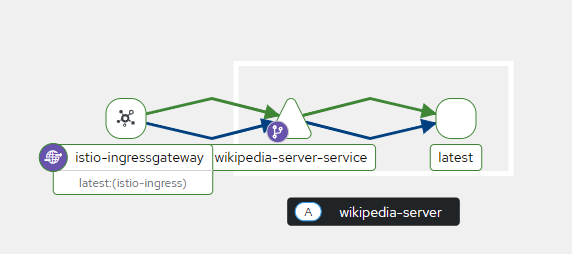

## 5.4. Wikipedia with init and sidecar

> a sidecar container that waits for a random time between 5 and 15 minutes, curls for a random Wikipedia page in URL https://en.wikipedia.org/wiki/Special:Random(opens in a new tab) and saves the page content to the public www directory for the main container

the main container based on nginx image, that just serves whatever content it has in the public www location
init container that curls page https://en.wikipedia.org/wiki/Kubernetes(opens in a new tab) and saves the page content to the public www directory for the main container

```yaml
---
containers:
  - name: main-container
    image: nginx
    volumeMounts:
      - name: public-www
        mountPath: /usr/share/nginx/html
  - name: sidecar-container
    image: busybox
    command:
      [
        "sh",
        "-c",
        "while true; do sleep $(( ( RANDOM % 600 ) + 300 )); wget -O /usr/share/nginx/html/index.html https://en.wikipedia.org/wiki/Special:Random; done",
      ]
    volumeMounts:
      - name: public-www
        mountPath: /usr/share/nginx/html
initContainers:
  - name: init-container
    image: busybox
    command:
      [
        "sh",
        "-c",
        "wget -O /usr/share/nginx/html/index.html https://en.wikipedia.org/wiki/Kubernetes",
      ]
    volumeMounts:
      - name: public-www
        mountPath: /usr/share/nginx/html
```

`kubectl apply -f wikipedia-pod.yaml`,

`kubectl apply -f wikipedia-access.yaml`

Additionally, Istio ingress was applied to this cluster, utilizing the default namespace in the ambient environment.

##



Sidecar containers: The TL;DR

A sidecar is a helper container that runs in the same Pod as your main container and shares resources (like network, volumes, or IPC).
They’re not the star of the show — they’re like the hype crew that makes sure the main container can focus on its job.

#### Rule of thumb:

Main container = does the core business logic.

Sidecar = extends, enhances, or supports that main process.
