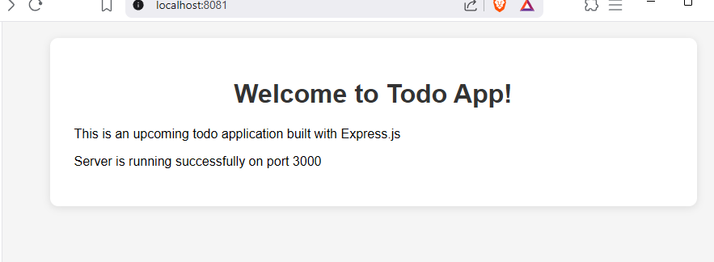

# 4.8 GitOps for Todo App

Todo App leverages GitOps for automated deployments, building on the approach from [4.7](../log_output/readme.md) with argocd

- same for the [todo-backend](../.github/workflows/todo-backend-gke_rollout.yaml)

## Prerequisites

- Review [4.7 Log Output GitOps](../log_output/readme.md) for a detailed walkthrough of the GitOps setup.
- Ensure ArgoCD is installed and configured in your cluster.
- Make sure you have set up the necessary secrets and permissions for GitHub Actions to access your container registry and repository.

## Additional Setup for Todo App

- **NATS Installation:**  
  The Todo App uses NATS for broadcast functionality. Install NATS in your cluster (in the appropriate namespace) using Helm:

  ```sh
  helm install --set auth.enabled=false my-nats oci://registry-1.docker.io/bitnamicharts/nats
  ```

  > Ensure NATS is running before deploying the Todo App to enable broadcast features.



## Checks:

- [ ] NATS is installed and running in your cluster.
- [ ] ArgoCD is up and configured to watch the correct namespace/repo.
- [ ] GitHub Actions workflow is set up for CI/CD (see `.github/workflows/todoapp-gke-rollout.yaml`).

For more details, refer to the [4.7 Log Output GitOps instructions](../log_output/readme.md).
