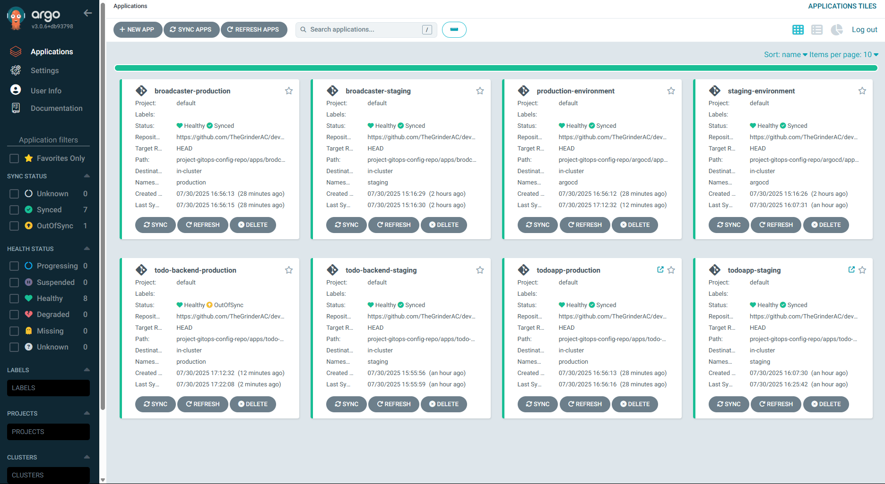

# 4.10: CI/CD and Deployment with ArgoCD

In this project, I've set up a GitOps-based CI/CD pipeline using GitHub Actions and ArgoCD to automate deployments to Kubernetes. Here’s how I've configured it to work.

## The GitOps Workflow

My deployment process is fully automated. I've configured two distinct environments: `staging` and `production`.

### Staging Deployment

I've set up the pipeline so that every commit I push to the `main` branch automatically deploys to the **staging environment**.

Here's the step-by-step flow:

1.  **Push to `main`**: When I push a code change to the `main` branch, it triggers my `deploy-staging.yaml` GitHub Actions workflow.
2.  **Build & Push Image**: The workflow builds a new Docker image for the application and pushes it to my container registry. The image is tagged with the unique commit SHA to ensure every version is distinct.
3.  **Update Manifests**: The workflow then automatically updates the `kustomization.yaml` file located in `project-gitops-config-repo/apps/todo-app/overlays/staging/`. It changes the image tag to the new one I just built.
4.  **ArgoCD Syncs**: My ArgoCD instance is configured to continuously monitor the `project-gitops-config-repo` repository. When it sees the change in the staging manifest, it automatically syncs the application.
5.  **Deployment**: ArgoCD pulls the new container image and deploys it to the `staging` namespace in my Kubernetes cluster.

### Production Deployment

For production, I wanted a more deliberate release process. Instead of deploying on every commit, I trigger deployments by creating a **tagged commit** (e.g., `v1.0.0`, `v1.1.0`).

The flow is the same as staging, but it's triggered by a tag and updates the `production` overlay instead:

1.  **Create a Tag**: I create a new Git tag and push it to the repository.
2.  **GitHub Actions Trigger**: This triggers the `deploy-production.yaml` workflow.
3.  **Build & Push Image**: The image is built and pushed, but this time it's tagged with the Git tag (e.g., `v1.0.0`).
4.  **Update Manifests**: The workflow updates the `kustomization.yaml` in the `project-gitops-config-repo/apps/todo-app/overlays/production/` directory.
5.  **ArgoCD Deploys**: ArgoCD detects the change and deploys the new version to the `production` namespace.

## One-Time ArgoCD Setup

To get this entire workflow started, I needed to configure ArgoCD to monitor my applications. I did this by applying the "app-of-apps" manifests from my `project-gitops-config-repo`. This was the only manual `kubectl` step I needed for the applications.

I ran the following commands to bootstrap the environments:

```bash
# Apply the staging app-of-apps manifest
kubectl apply -f project-gitops-config-repo/argocd/apps-of-apps/staging.yaml

# Apply the production app-of-apps manifest
kubectl apply -f project-gitops-config-repo/argocd/apps-of-apps/production.yaml
```

After running these, ArgoCD took over and started managing the deployments based on the manifests in my Git repository.

# Importent checks:

> Please review for checks like argocd installlation, canary updates installation, prometheus installation, gatewayAPI ready cluster updates etc , [refer to the 4.7 Log Output GitOps instructions](https://github.com/TheGrinderAC/devops-with-kubernetes/blob/4.8/log_output/readme.md) also [4.8 for NATS config in namespaces](https://github.com/TheGrinderAC/devops-with-kubernetes/blob/4.9/todo%20app/readme.md).

> For production postgress backup need this secret(), for gcp service permission
> ` kubectl create secret generic gcs-secret --from-file=key.json=key.json -n production  --dry-run=client -o yaml | kubectl apply -f -`



````
PS C:\Users\Bidhi> kubectl get ing -n production
NAME                    CLASS    HOSTS   ADDRESS        PORTS   AGE
prod-todo-app-ingress   <none>   *       34.120.60.10   80      30m
PS C:\Users\Bidhi> kubectl get ing -n staging
NAME                       CLASS    HOSTS   ADDRESS       PORTS   AGE
staging-todo-app-ingress   <none>   *       35.241.11.2   80      79m
PS C:\Users\Bidhi> curl -X GET http://35.241.11.2

    <!DOCTYPE html>
    <html>
      <head>
        <title>The project App</title>
        <meta charset="UTF-8">
        <meta name="viewport" content="width=device-width, initial-scale=1.0">
        <style>
          body {
            font-family: Arial, sans-serif;
            max-width: 800px;
            margin: 0 auto;
            padding: 20px;
            background-color: #f5f5f5;
          }
          ... //ommited
        <div class="container">
          <h1>The project App</h1>

          <div class="image-container">
            
          </div>

          <p class="subtitle">DevOps with Kubernetes 2025</p>

          <div class="todo-container">
            <h2>My Todos</h2>
            <form action="/todos" method="post">
              <input type="text" name="todo" placeholder="Add a new todo..." maxlength="140">
              <button type="submit">Send</button>
            </form>
            <ul class="todo-list">
              <!-- Todos will be rendered here -->
            </ul>
          </div>

          ....// ommited
    </html>

PS C:\Users\Bidhi> curl -X GET http://34.120.60.10

    <!DOCTYPE html>
    <html>
      <head>
        <title>The project App</title>
        <meta charset="UTF-8">
        <meta name="viewport" content="width=device-width, initial-scale=1.0">
        <style>
          body {
            font-family: Arial, sans-serif;
            max-width: 800px;
            margin: 0 auto;
            padding: 20px;
            background-color: #f5f5f5;
          }
          h1 {
            color: #333;
            text-align: center;
            margin-bottom: 30px;
          ... //ommited
        </style>
      </head>
      <body>
        <div class="container">
          <h1>The project App</h1>

          <div class="image-container">
            
          </div>

          <p class="subtitle">DevOps with Kubernetes 2025</p>

          <div class="todo-container">
            <h2>My Todos</h2>
            <form action="/todos" method="post">
              <input type="text" name="todo" placeholder="Add a new todo..." maxlength="140">
              <button type="submit">Send</button>
            </form>
            <ul class="todo-list">
              <!-- Todos will be rendered here -->
            </ul>
          </div>

          ... //ommited
        </div>
      </body>
    </html>
    ```
````
