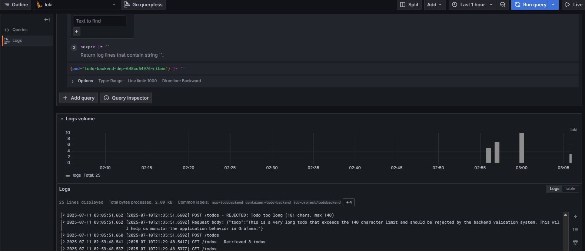

# 2.10. The project, step 13

> - Created Kubernetes Monitoring Setup

Added request logging so that you can monitor every todo that is sent to the backend.
Set the limit of 140 characters for todos into the backend as well. Used curl to test that too long todos are blocked by the backend and you can see the non-allowed messages in your Grafana.

Step 1: Install Helm Repositories

```bash
helm repo add prometheus-community https://prometheus-community.github.io/helm-charts
helm repo add grafana https://grafana.github.io/helm-charts
helm repo update
```

Step 2: Install kube-prometheus-stack (Latest Version)

```bash
kubectl create namespace monitoring

# Install latest kube-prometheus-stack
helm install kube-prometheus-stack prometheus-community/kube-prometheus-stack \
  --namespace monitoring \
```

Step 3: Access Grafana

```bash
# Get Grafana admin password(using ps)
$encodedPassword = kubectl get secret --namespace monitoring kube-prometheus-stack-grafana -o jsonpath="{.data.admin-password}"

# Port forward to access Grafana
kubectl port-forward --namespace monitoring svc/kube-promethe
us-stack-grafana 3000:80
```

Step 4: Installed Lightweight Setup (Loki 2.9.3 )

```bash
kubectl create namespace loki-stack

helm upgrade --install loki --namespace=loki-stack grafana/loki-stack --set loki.image.tag=2.9.3
```

> Finally applied the manifests appropriately and run the localhost 3000 with username admin and password got from the cmd and see the logs of backend of todo application :


